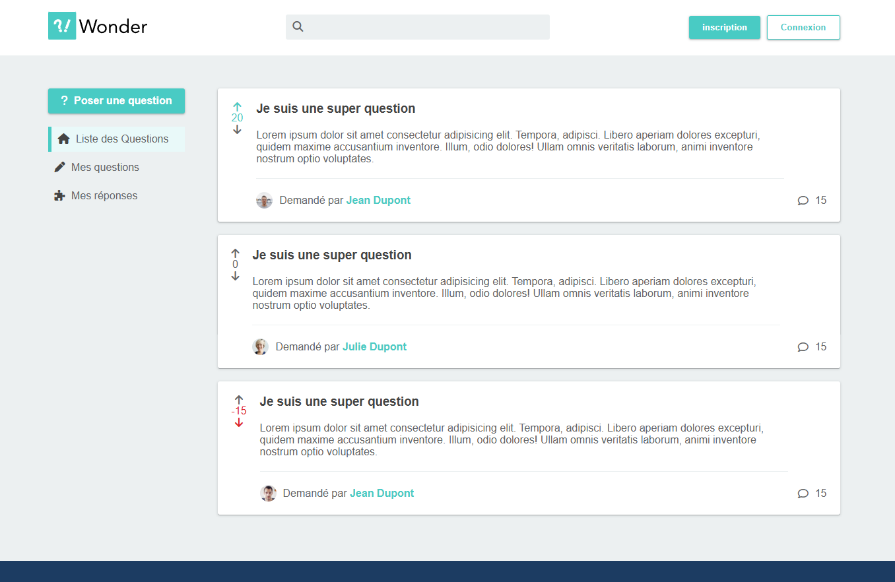

# 🌟 Wonder - Projet Symfony (Tuto Dyma)

**Wonder** est un projet web développé avec le framework PHP **Symfony**.  
Il s'agit d'une plateforme de questions/réponses inspirée de **Quora**, où les utilisateurs peuvent poser des questions, répondre à celles des autres et interagir avec la communauté.

Ce projet a été réalisé dans le cadre d’un tutoriel proposé par la plateforme [Dyma](https://dyma.fr), et sert d’exemple concret pour apprendre et maîtriser Symfony.

---

## 📸 Aperçu

---

## 🚀 Fonctionnalités principales

- Authentification (inscription, connexion, déconnexion)
- Création, édition et suppression de questions
- Création de réponses aux questions
- Système de votes sur les réponses (optionnel)
- Catégorisation des questions avec des tags
- Interface utilisateur responsive avec Bootstrap
- Panneau d’administration (optionnel selon le tutoriel)

---

## 🧑‍💻 Stack technique

- **Backend** : Symfony (PHP)
- **Base de données** : MySQL
- **ORM** : Doctrine
- **Frontend** : Twig + Bootstrap
- **Authentification** : Symfony Security
- **Environnement de développement** : Symfony CLI / Composer

## 🧑‍🎓 À propos
Ce projet a été développé par Alexis Delaunay
dans le cadre d’un apprentissage Symfony via [Dyma](https://dyma.fr/developer/list/chapters/core).
